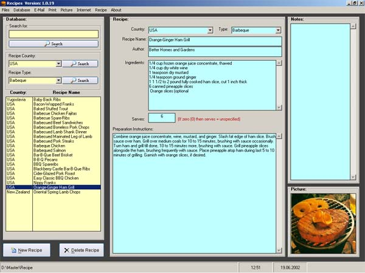



## Recipe

### Description

This is just a relative simple database program for storing of food recipe's. I have included approximately 1050 recipe's with the source code, unfortunately I had to remove all the recipe pictures, as I got a 25 MB database with pictures.

This source code is yours for the keeping, and you are free to use it as you wish.

Please do not bother to vote - but I would very much appreciate any feedback.

Have a nice day.
 
### More Info
 

             |
---                |---
**Submitted On**   |2002-06-19 12:47:30
**By**             |[Jorgen Levesen](https://github.com/Planet-Source-Code/PSCIndex/blob/master/ByAuthor/jorgen-levesen.md)
**Level**          |Intermediate
**User Rating**    |4.2 (21 globes from 5 users)
**Compatibility**  |VB 6\.0, VBA MS Access
**Category**       |[Complete Applications](https://github.com/Planet-Source-Code/PSCIndex/blob/master/ByCategory/complete-applications__1-27.md)
**World**          |[Visual Basic](https://github.com/Planet-Source-Code/PSCIndex/blob/master/ByWorld/visual-basic.md)
**Archive File**   |[Recipe964056192002\.zip](https://github.com/Planet-Source-Code/jorgen-levesen-recipe__1-36019/archive/master.zip)

